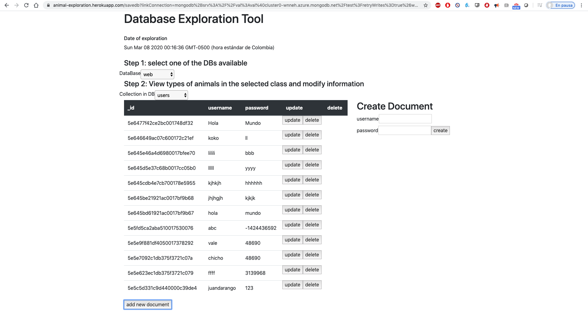

# Database Exploration
Database Exploration is a web application meant to help users explore their Mongo Databases. It is possible to get a list of databases and for each DB identify its collections. Once a collection is selected the list of documents for that collection becomes available. The application allows users to add a new document to a collection, update a document and delete a document. 



This application has API REST to connect to  Mongo obtaining databases, collections and documents. 
## Author
[Valentina Chacón Buitrago](https://github.com/ValentinaChaconBuitrago)

## Objectives
* Develop a dynamic web page that shows and updates a list databases, allowing users to obtain collections and documents in each db. 
* Implement both server side and client side rendering of content in the page.
* Create a tool that persists user's information.

## Technologies used
* HTML, CSS, Bootstrap, Javascript, Node.js, Express.js, MongoDB, Mongo Atlas, ejs

## Application deployment
This application has both a front and back end, and it is necessary to have a certain setup in order to use it. 
### Requirements
#### Node.js
If you don't have Node.js installed, you can download it [here](https://nodejs.org/en/).
#### MongoDB 
If you're storing your data locally, install Mongo following the instructions [here](https://www.mongodb.com/en).
Once you have Mongo installed, run the following command in your terminal:
```
mongod
mongo
```
In case you are using Mongo Atlas and your data is stored in the cloud, whitelist your IP address and create a new data base user. More details on how to configure this set up [here](https://docs.atlas.mongodb.com/driver-connection/).
The application asks for the Mongo url, which is then included so there's no need to store those fields in the project. The latter works for either local and remote databases. 

### Yarn for MAC
This project was developed using MAC's iOS, if using this same OS install yarn using the following command:
```
brew install yarn
```

Because this project was implemented using Mongo Atlas, the database is already available so, to run the application, just use the following command:
```
yarn start
```
After this, the application will be available at http://localhost:3000/

## Deployed Application
[Database Exploration](https://animal-exploration.herokuapp.com/)

## License
[MIT License](https://github.com/ValentinaChaconBuitrago/Search_Restaurants/blob/master/LICENSE)
